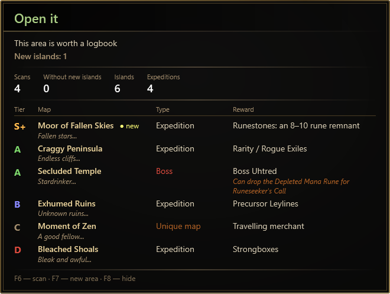
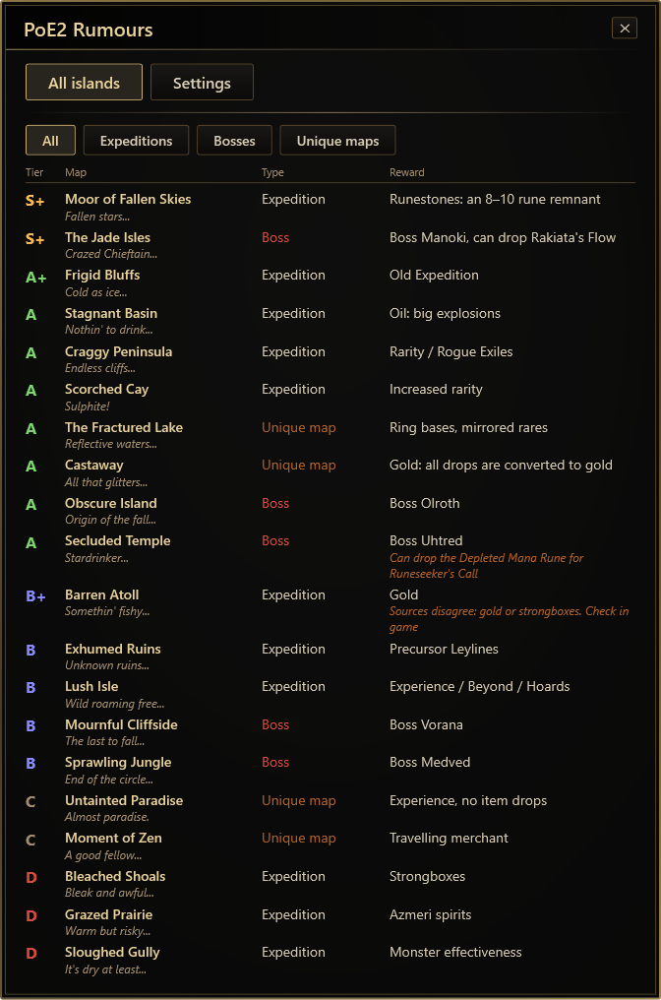
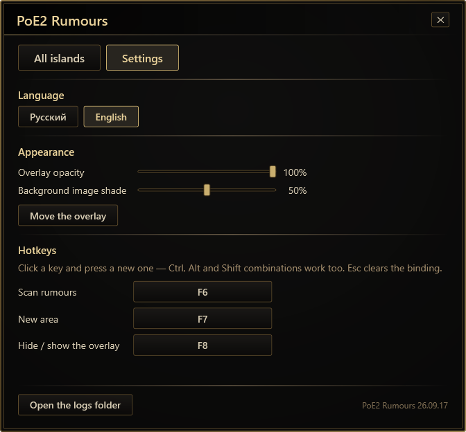

#  PoE2 Rumours

An overlay for **Path of Exile 2** Expedition farming. Hover an uncharted ocean area, press a hotkey, and it
reads the island rumours off the tooltip, remembers every island the area has shown so far and tells you
whether the area is worth a logbook.

## Why

Before you chart an area the game shows up to three *island rumours* — hints at the special islands hidden
there. Only three are shown at a time, and they reshuffle whenever you move an item in your inventory, so
finding out what an area really holds means reading the tooltip again and again and remembering what each
rumour stands for. PoE2 Rumours does the reading and the remembering.

## Features

- Reads the "Uncharted Waters" tooltip from the screen with the OCR built into Windows — one hotkey, no typing.
- Accumulates the islands of an area across scans and counts how many scans in a row brought nothing new.
- Rates every island (tier, type, reward) and gives a verdict: **Open it**, **Skip it** or **Keep scanning**.
- The same hotkey identifies an already opened special map when you hover it.
- A reference of all 20 special islands, filterable by type.
- Click-through overlay: it never takes focus or mouse clicks away from the game.
- English and Russian game clients, detected automatically. English and Russian interface.
- Rebindable hotkeys, adjustable opacity, movable overlay, editable ratings.

| All islands | Settings |
| --- | --- |
|  |  |

## Install

1. Download `Poe2Rumours.exe` from the [latest release](../../releases/latest). It is a single self-contained
   file; nothing else needs to be installed.
2. Put it anywhere and run it. A golden compass icon appears in the tray (Windows 11 may hide it under the "^" arrow).
3. Run the game in **Windowed Fullscreen** — overlays cannot draw over exclusive fullscreen.

Requirements: Windows 10 version 2004 or later, and the Windows language pack that matches your game client
language (see [Troubleshooting](#troubleshooting)).

The exe is not code-signed, so Windows SmartScreen may warn about an unknown publisher: choose *More info →
Run anyway*. Every release lists the SHA-256 of the file, and the exe is built from this source by a public
CI workflow.

## How to use

1. Hover an uncharted ocean area so that the rumour tooltip appears, and press **F6**.
2. Move any item in your inventory, or toggle a saga — the game reshuffles the rumours. Hover again, press **F6**.
3. Repeat. The overlay adds new islands as they show up and keeps the verdict up to date. When the
   "Without new islands" counter has grown enough for your taste, the set is probably complete.
4. **F7** starts a new area. **F8** hides or shows the overlay.

Hovering an already opened special map and pressing **F6** shows what that map is instead. A map scan and an
area scan reset each other.

Click the tray icon to open the menu: the island reference and the settings. Right-click it to exit.

## Is this allowed?

PoE2 Rumours only **looks at the screen**. It does not read or modify the game's memory, does not touch game
files, and never sends keystrokes or mouse input to the game: one key press takes one screenshot of the area
around your cursor. Reshuffling the rumours is always done by you. The screenshot is processed on your
computer and goes nowhere.

That puts it in the same family as other screen-reading overlays, but no third-party tool is officially
approved by Grinding Gear Games, and you use it at your own risk.

## Your data

Everything the program writes lives in `%LOCALAPPDATA%\PoE2 Rumours`:

- `settings.json` — hotkeys, language, appearance, window positions. Managed from the Settings tab.
- `ratings.default.json` — the built-in island ratings, rewritten on every start for reference.
- `ratings.json` — optional. Copy `ratings.default.json` under this name and edit the tiers, rewards, notes and
  verdict thresholds to match your own strategy; it takes priority over the built-in ratings.
- `theme\panel.png` — optional dark background picture for the panels.
- `logs` — a text log of every scan and `errors.log`. Screenshots are **not** saved unless you set
  `"saveShots"` to `"failed"` or `"all"` in `settings.json`.

Deleting that folder resets the program. Nothing is written next to the exe or to the registry.

## Troubleshooting

**"Windows has no language pack with text recognition…"** — the program needs the Windows OCR engine for your
game client language. Open *Settings → Time & language → Language & region → Add a language*, add **English
(United States)** (or Russian for the Russian client) and make sure the optional *Text recognition* feature is
included. It does not have to be your display language.

**"No tooltip found"** — press the hotkey while the rumour tooltip is fully visible and the cursor is still.
If it keeps happening, set `"saveShots": "failed"`, reproduce it, and attach the screenshot and
`logs\scans.log` to an issue.

**The overlay is not visible** — switch the game to Windowed Fullscreen; check that F8 did not hide it.

**Other client languages** are not supported yet; adding one is mostly data — see
[ARCHITECTURE.md](ARCHITECTURE.md) and [CONTRIBUTING.md](CONTRIBUTING.md).

## Building from source

Requires the .NET 9 SDK on Windows.

    dotnet test
    publish.bat

`publish.bat` produces a self-contained `dist\Poe2Rumours.exe` and prints its SHA-256.
The project structure and the reasoning behind it are described in [ARCHITECTURE.md](ARCHITECTURE.md).

## Credits

- Island tiers and reward notes started from the community Expedition sheet by **Jestra1220**, as presented by
  [Gnejs PoE Tools](https://poe.gnejs.app/poe2/expedition).
- The rumour-to-map mapping and the localised texts were checked against [PoE2DB](https://poe2db.tw).

## Disclaimer

PoE2 Rumours is a fan-made tool. It is not affiliated with, endorsed or approved by Grinding Gear Games.
Path of Exile is a trademark of Grinding Gear Games. No game assets are included in this repository or in
the releases.

## License

[MIT](LICENSE)
